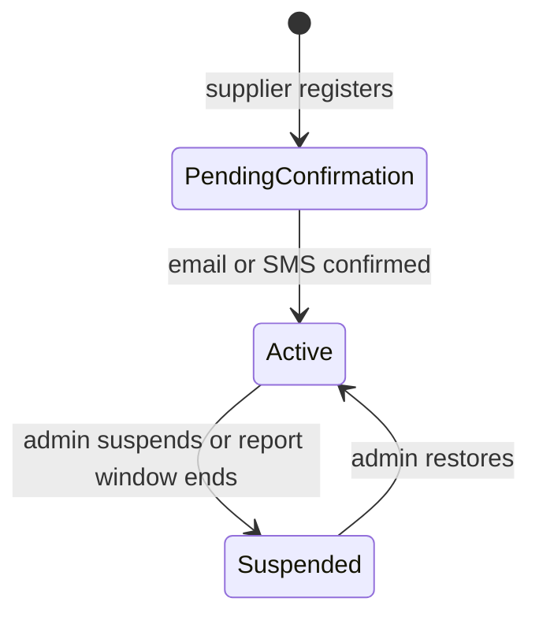
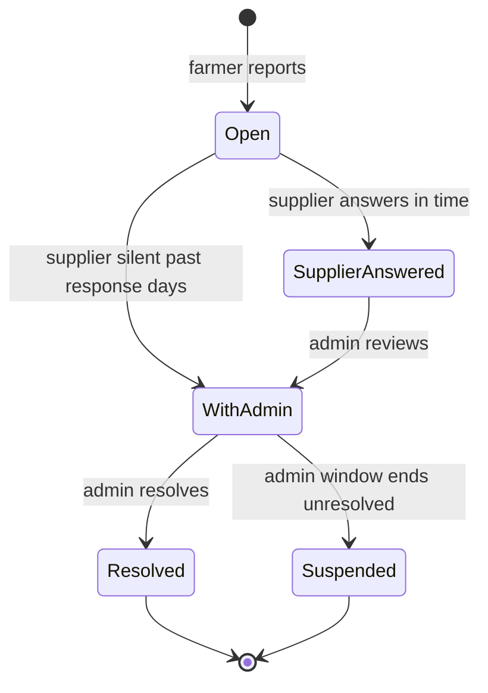
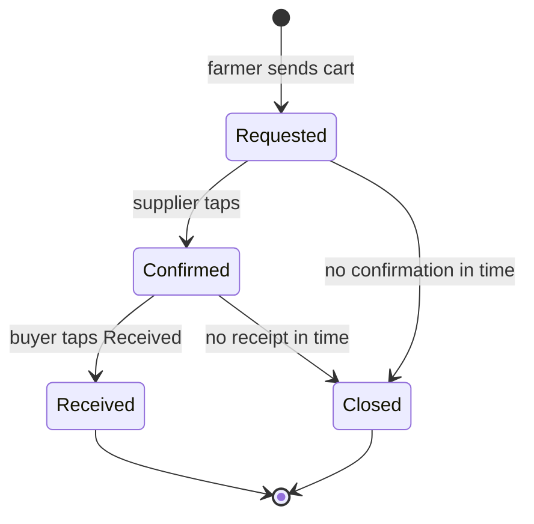
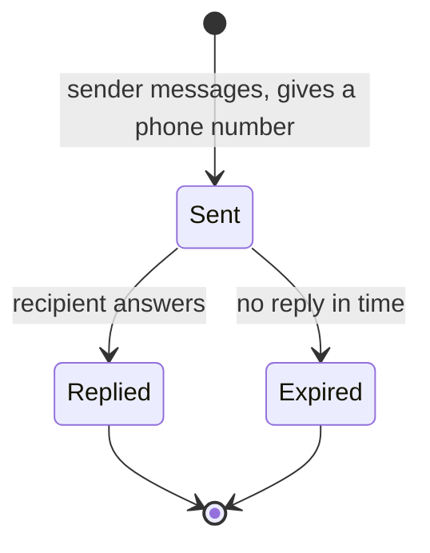
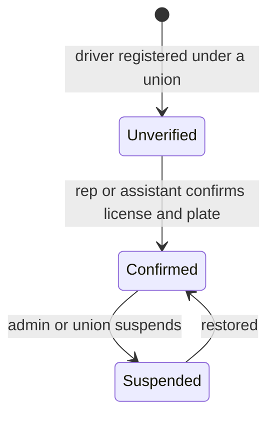

# NkwaLedger Marketplace MVP - Build Specification

2026-09-21 · @Someone

## Purpose and scope

The MVP lets farmers find input suppliers near them, send a request to a supplier's kiosk, and list their own produce for sale, with no payment handled inside NkwaLedger. Claude Code builds it from this document, one step at a time, test first.

In scope:

- Supplier accounts and kiosks, each with a permanent number
- A product catalog with images, barcodes or QR codes, prices, in-stock switch and expiry dates
- Farmer browsing by location and stock, suggestions by farm type, and calling a kiosk
- A cart that sends a request to a kiosk, two-sided confirmation of every sale, and reviews
- Kiosk reports, admin alerts and suspension
- A shared contact-request flow (message first, number shown only after a reply) used for every farmer, buyer and driver personal number
- Farmer produce listings, buyer confirmation by SMS or link, and the link to the farmer's ledger
- Market centers, registered buyer accounts, and buyer-to-farmer matching
- Transport unions, drivers and delivery confirmation
- A USSD option to find a supplier

Everything else is listed under Out of scope and later phases.

## Settled decisions

These were decided in discussion. Claude Code must build them as written and must not change them. Durations are settings, never hard-coded (see Configurable settings).

### Suppliers and kiosks

- A kiosk is one shop or outlet. It has a permanent system-assigned number (format NKL-####), a name, a thumbnail image, a map pin, region and district, and a contact number. The number never changes and is never reused. The kiosk name must not be more than certain number of characters.
- A supplier may eventually run several kiosks, but only 1 without admin approval. One email owns up to 1 kiosk. A 2nd and any further kiosk needs admin approval. The cap counts by verified email and by verified phone.
- The supplier's email is required. A kiosk is not visible to farmers until the supplier confirms by email or SMS. No admin approval is needed for a normal kiosk. Admin can see everything.
- ID checks and business registration checks are postponed. Store the fields now so they can be switched on later: ID number (hashed, as the Ghana Card is elsewhere), ID photo, business registration number, and a verification status. Kiosk visibility must read that status.

### Products, prices, stock and expiry

- Each product has an image, a barcode or QR code (scanned, uploaded or typed), a category and a unit from admin-managed lists, a price per unit, and an in-stock or out-of-stock switch. Products that expire must carry an expiry date.
- The first supplier to register a barcode creates the product record. Later suppliers reuse it. Admin can seed product records and merge duplicates. Products with no barcode are allowed and marked "no barcode". Suppliers do not wait for admin approval to list. Admin can inspect a supplier's stock afterwards.
- Confirming a price is never mandatory. When a price has not been confirmed for the stale-price period, the supplier gets an email reminder and an in-app notice with a one-tap "price unchanged", and admin gets an alert. Farmers never see any stale-price warning. Products stay visible. Admin can email the supplier or suspend the product.
- Every price change is logged with who, when, old price and new price. Prices are never overwritten.
- A kiosk whose products are all out of stock is hidden from farmer search automatically. Expired products are hidden when the search runs. The supplier gets an email alert before a product expires.
- Kiosks are found by location and stock availability, filtered by category, with suggestions by farm type (crop farmers see fertilizer, seed and chemical kiosks first; animal farmers see feed and vet kiosks). There is no "New" tag.

### Reports and suspension

- A logged-in farmer can report a kiosk with a "Report this kiosk" button, once per kiosk. Each report emails the supplier and alerts admin. The supplier has a response period to answer.
- If the supplier stays silent, the case goes to admin, who has a period to contact the supplier. If it is still unresolved after that period, all of that supplier's kiosks are suspended. Admin can suspend earlier at any time.

### Orders, confirmation, reviews and commission

- The cart sends a request to the kiosk. There is no payment in the app and NkwaLedger holds no money. A payment request to the buyer's phone is parked for later.
- Every order has a status timeline: requested, confirmed by the supplier, handed over and received. Each step records who did it and when. An order records the facilitating agent, if any. This is separate from the agent assigned to verify the farmer.
- A sale counts toward a kiosk's sales number, and can be reviewed, only when both sides have tapped. The supplier taps to confirm. The buyer taps "Received". One review per confirmed order.
- For supplier-to-farmer orders the farmer taps in the app. For farmer-to-buyer produce sales the buyer has no account and confirms by SMS reply or a single-use link. The agent may co-confirm.
- A produce sale confirmed only by the buyer stays out of the credit score until an agent co-confirms it and admin approves it. This is the rule for now.
- An order with no buyer confirmation after the buyer-confirmation period closes as unconfirmed and does not count.
- Agents can earn commission on sales they help arrange. The percentage is not agreed. The MVP builds no payout logic. Admin regularises commission, so none is paid without admin approval. The commission log records the facilitating agent and whether that agent also verifies the farmer.
- Logistics in the MVP means agent-arranged pickup and a handover confirmation only.

### Farmer produce listings

- A listing is tied to a real confirmed stock batch. Its quantity is capped at the batch's stock minus what other active listings already claim. It has a photo and an optional "harvest due" flag. It is public and browsable with no login, on the app and later the website.
- Farmers and agents can post. An agent posting for a farmer needs that farmer's agreement first.
- Crop listings expire after a number of days the farmer sets, with a reminder before expiry. Animal listings never expire. The farmer or agent gets a "still available?" prompt on a schedule, and the listing is hidden if nobody answers.
- Marking a listing Sold requires recording the sale. It opens the normal sale form. The farmer types the amount. The app never multiplies price by quantity. The farmer confirms before it posts. If an agent marks it, the farmer still confirms. Partial sales are allowed. Withdrawing a listing needs no ledger entry.
- No phone number is ever printed as text on a listing, public or in-app. Contact goes through the shared contact-request flow below. The central NkwaLedger support line (a configurable setting) still shows on every listing, separate from any farmer contact.

### Contact requests

This replaces showing any phone number directly, anywhere in the marketplace. It applies to every farmer, buyer and driver personal number: produce listings, buyer want posts, and driver profiles. It exists to stop numbers being scraped from the public site, with good UX: a real visitor taps one button either way.

- Every listing, want post and driver profile shows an "I'm interested" button instead of a number. No login is needed to send one, but the sender must give a phone number to send it, so the recipient has a channel to answer to.
- The recipient gets a notification, in-app and by SMS, showing the message and the sender's number.
- If the recipient replies, from that point both sides can see each other's number inside the app, and can continue by phone or in-app message.
- A recipient who never replies never exposes their number. Nothing beyond "message sent" is shown to the sender.
- A kiosk's own contact number is different: it is a business number the supplier chose to publish, and keeps showing on kiosk cards as decided under Suppliers and kiosks. This section is only about personal numbers.

### Market centers and buyer matching

- A market center (for example Makola, Kejetia) is an admin-managed place. A registered buyer associates their account with one or more market centers, which anchors their location for matching.
- Anyone can browse produce listings and buyer want posts with no login, on the app and the website. An account is needed only to post a want, receive match suggestions, or use later features such as delivery help.
- A registered buyer sets up a standing want: crop, quantity, and a timing window. A want post is public and browsable, the same as a produce listing, not only pushed privately to the buyer.
- Matching runs both ways and both live and in batch. The moment a farmer's listing fits an open want, the buyer is notified live. A scheduled batch match also runs on a period, to catch fits from data that changed without a live trigger. A farmer with an active listing also sees which open wants fit it, so the farmer can reach out first.
- Matching uses both sides' profiles, not only the single stated want: crop types, typical volumes, location, and past confirmed deals, to rank several fits against each other.
- Contact after a match goes through the same Contact requests flow. A match is a suggestion, never an automatic introduction.

### Transport unions and drivers

- A transport union is registered by admin, with exactly one rep and one assistant rep.
- The rep or assistant confirms a driver's real details: license number, license expiry date, and plate number. This is a genuine check, not a formality, so who confirmed it and when is recorded in the audit log.
- A confirmed driver shows a "License verified" badge. The badge stops showing automatically once the recorded license expiry date passes, without anyone removing it by hand.
- A driver offers both a committed route and vehicle, and separate on-demand availability. Farmers and buyers can browse and pick a union or driver directly, or get one suggested by district, the same pattern as kiosks.
- A driver's profile shows his delivery history ("runs"): visible to other drivers in the same union for coordination, and to farmers and buyers as a track record, the same way a kiosk shows its sales count. A delivery only joins that history once both the driver and the farmer or buyer confirm it, the same two-sided tap used for kiosk orders.
- Transport is contacted through the same Contact requests flow. Payment for transport is outside the app, by cash or any other means the two sides agree, the same as kiosk purchases.
- This sits alongside, not instead of, agent-arranged pickup: agent-arranged pickup is the small-scale option, transport unions are for bigger loads and longer distances.

### Fraud monitoring

- Input purchases keep recording an amount only. No product or quantity is added to that form.
- The price check compares a farmer's purchase with the kiosk's listed price and the admin reference price. It applies only to purchases linked to a kiosk through the marketplace. All other input purchases get only a coarse spend check against similar farms, in the later fraud phase.

### Later

- The website will be a full e-commerce marketplace. The in-app marketplace expands later. Both come after this MVP.

## Actors and permissions

Six kinds of people touch the marketplace. Every permission is enforced on the server, never only by hiding a button.

| Actor | Can | Cannot |
| --- | --- | --- |
| Farmer (smartphone) | Browse kiosks, call a kiosk, send a cart request, tap "Received", review a confirmed order, report a kiosk once, create and manage own produce listings, mark own listing Sold (which opens the sale form), send and reply to contact requests | Confirm a supplier's side of an order, see supplier private data, review a kiosk without a confirmed order, see another person's number before either side has replied to a contact request |
| Farmer (feature phone) | Use USSD "Find a supplier" | Order or list through USSD in this MVP |
| Agent | Do what a farmer can for assigned farmers, post a listing only after that farmer agrees, arrange an order as facilitating agent, co-confirm a buyer's confirmation | Confirm as the supplier, approve own commission, act for a farmer who is not assigned to him |
| Supplier | Manage own kiosks and products, confirm orders, answer reports, tap "price unchanged", see own notifications | Review or report own kiosk, confirm own purchases as a farmer, edit the kiosk number, see other suppliers' data |
| Admin | See all kiosks, products, reports, orders and transport unions, seed and merge catalog records, inspect stock, approve a 2nd kiosk, register a transport union and its rep, suspend or restore a product, kiosk, supplier, union or driver at any time, approve buyer-only sales for the credit score, regularise commission, change settings, read the audit log | Edit a supplier's confirmed sale or a farmer's ledger entry directly |
| Buyer (anonymous, no account) | Browse kiosks and produce listings, confirm a produce sale by SMS reply or a single-use link, send and reply to contact requests | Post a standing want, get match suggestions, see a match history |
| Buyer (registered) | Everything an anonymous buyer can, plus associate with one or more market centers, post a public standing want, receive match suggestions, see a farmer's or driver's confirmed track record | Confirm a farmer's or supplier's side of an order |
| Transport union rep / assistant rep | Register drivers under their own union, confirm a driver's license and plate details, see their union's driver list and runs | Confirm a driver for another union, edit a driver's confirmed details without recording a new check |
| Driver | State a committed route and vehicle, and on-demand availability, see other drivers' runs within his union, tap to confirm a delivery, send and reply to contact requests | Confirm his own delivery on both sides, appear to farmers and buyers before his union rep confirms him |

Roles must reuse the app's existing role and permission system. Vets and extension officers have no marketplace access in this MVP.

Roles must reuse the app's existing role and permission system. Vets and extension officers have no marketplace access in this MVP.

## Configurable settings

Every duration and limit below is a setting that an admin can change, and none may be hard-coded. Each setting has a default. Code reads them through one settings service, and every change is written to the audit log.

| Setting key | Default | What it controls |
| --- | --- | --- |
| marketplace.supplier\_report\_response\_days | 3 | Days a supplier has to answer a report before it goes to admin |
| marketplace.admin\_intervention\_days | 15 | Days admin has to contact a silent supplier before all that supplier's kiosks are suspended |
| marketplace.buyer\_confirmation\_days | 15 | Days before an order with no buyer confirmation closes as unconfirmed |
| marketplace.crop\_listing\_reminder\_days | 5 | Days before a crop listing expires that the farmer gets a reminder |
| marketplace.animal\_listing\_prompt\_days | 15 | Days between "still available?" prompts on an animal listing |
| marketplace.product\_expiry\_alert\_days | 30 | Days before a product's expiry date that the supplier gets an email alert |
| marketplace.price\_stale\_days | 15 | Days without a price confirmation before the supplier is reminded and admin is alerted |
| marketplace.kiosks\_per\_email\_cap | 1 | Kiosks one verified email or phone can own without admin approval |
| marketplace.central\_contact\_number | set by admin | The NkwaLedger line shown next to a farmer's number on a listing |

A deadline is computed when the event happens and stored on the record (for example a report's due date). A later change to a setting affects new records only. The scheduled jobs that act on deadlines read the stored dates.

## Data model

These are the entities and the fields that matter. Claude Code must follow the app's existing naming, soft-delete, uuid and migration conventions, and must extend an existing table when one already covers the entity (check suppliers first). Money is stored as whole pesewas in an integer column, as the ledger does.

| Entity | Key fields and rules |
| --- | --- |
| Supplier | user link, business name, business registration number, ID number hash, ID photo path, verification status (unverified, email and phone verified, ID verified), account status (active, suspended) with who, when and why |
| Kiosk | supplier, kiosk number (KSK-####, generated from a database sequence, unique, never edited, never reused), name, thumbnail path, latitude, longitude, region, district, contact phone, status (pending confirmation, active, suspended), confirmed at |
| Product category | admin-managed list; flag for whether products in it must carry an expiry date |
| Product unit | admin-managed list (for example kg, litre, bag) |
| Catalog product | the shared record: barcode (nullable, unique when present), barcode type, name, category, unit, pack quantity, created by (supplier or admin), seeded flag, merged-into pointer |
| Kiosk product | kiosk, catalog product, image path, price per unit, in stock flag, expiry date, price confirmed at, status (active, suspended); unique per kiosk and catalog product |
| Price history | kiosk product, old price, new price, changed by, changed at, type (changed or confirmed unchanged); rows are never edited or deleted |
| Kiosk report | kiosk, reporter (unique per kiosk and reporter), reason, details, status (open, supplier answered, with admin, resolved, suspended), supplier due at, admin due at, supplier answer, resolved by and at |
| Order | uuid, type (input purchase or produce sale), status, farmer, kiosk (input orders), listing (produce sales), buyer phone (produce sales, stored encrypted), facilitating agent (nullable), requested at, confirmed at, received at, closed at with reason, counts toward stats flag |
| Order item | order, kiosk product, quantity, unit price and product name copied at the time of order |
| Order event | order, status, actor type and id, note, time; the timeline, append only |
| Confirmation token | order, token hash, channel (SMS reply or link), expires at, used at; single use |
| Review | order (unique), kiosk, farmer, rating 1 to 5, comment |
| Produce listing | farmer, stock batch, quantity, unit, asking price as typed, description, photo path, harvest due date, kind (crop or animal), expires at (crops), next prompt at (animals), status (active, sold out, closed, expired, withdrawn), posted by, farmer agreed at |
| Sale credit flag | on a produce sale: buyer confirmed at, agent co-confirmed by and at, admin approved by and at, credit eligible (true only when all three exist) |
| Agent commission entry | order, facilitating agent, whether that agent also verifies this farmer, status (pending admin, approved, rejected), approved by and at; no amounts or percentages in the MVP |
| Contact request | sender type and id, sender phone, recipient type and id, subject (listing, want, driver profile), message, status (sent, replied, expired), sent at, replied at; numbers become mutually visible only once replied\_at is set |
| Market center | name, region, district; admin-managed |
| Buyer profile | user link, phone verified at, market centers (many), created at |
| Buyer want | buyer, crop or category, quantity, unit, timing window start and end, status (open, closed), created at |
| Match | buyer want, produce listing, matched at, notified buyer at, notified farmer at; a want and a listing can match more than once as either side changes |
| Transport union | rep user link, assistant rep user link, name, region, district, status (active, suspended) |
| Driver | transport union, user link, license number, license expiry date, plate number, verification status (unverified, confirmed), confirmed by and at, status (active, suspended) |
| Delivery (run) | driver, order or listing reference, farmer or buyer counterpart, driver confirmed at, counterpart confirmed at, counts toward run history flag |
| Marketplace setting | key, value, updated by, updated at |

Audit: every status change, suspension, setting change, admin approval, price change, and driver confirmation writes to the existing audit log.

Audit: every status change, suspension, setting change, admin approval and price change writes to the existing audit log.

## Rules and workflows

Each rule below is testable. Time-based rules run as scheduled jobs that read stored due dates.

### Kiosk lifecycle

1. A kiosk in Pending confirmation or Suspended is never returned to farmers until admin restores it
2. Suspending a supplier suspends all of that supplier's kiosks in one action. Restoring is a separate admin action.
3. Out-of-stock hiding is not a status. A kiosk is left out of farmer search whenever it has no in-stock, unexpired product. It returns by itself when one exists.
4. Registering a 2nd kiosk (above the cap, counted by verified email and by verified phone) creates the kiosk in Pending confirmation and raises an admin approval request. It stays hidden until admin approves.
5. A suspended email or phone cannot register a new supplier.

### Products, price, stock and expiry

1. A supplier can list a product with only a name, category, unit, price and image. A barcode is optional; without one the product is marked "no barcode".
2. Scanning or typing a barcode that already has a catalog record reuses it and pre-fills name, category and unit. A new barcode creates the record. The typed name is free text.
3. A QR code in GS1 Digital Link format is parsed for product number, batch and expiry. Any other QR content is stored and shown as plain text and is never opened or fetched by the server.
4. A photo of a code is not proof that the supplier stocks the product, and the app must never label a product "verified" because it has a barcode.
5. A price change writes a price history row. "Price unchanged" also writes a row of type confirmed and updates the confirmed-at time.
6. When a price has gone unconfirmed for the stale-price period, send the supplier an email and an in-app notice, and raise an admin alert. Do this once per stale period, not daily. Do not show anything to farmers and do not hide the product.
7. Products past their expiry date are excluded at query time, not only by a nightly job. The supplier email alert goes out the alert period before the date.
8. Product images are resized and compressed on upload, with a limit on size and on count per product. Admin can remove an image.

### Reports and suspension

1. A farmer can report a kiosk once. Reports from farmers with a confirmed order at that kiosk are marked as such for admin.
2. Creating a report emails the supplier and alerts admin at once, and stores the supplier due date.
3. An answered report goes to admin. Nothing is suspended automatically because a supplier answered.
4. A silent report goes to admin as needing contact, and the admin due date is stored.
5. If the admin window ends unresolved, all of that supplier's kiosks are suspended and the supplier is emailed.
6. Admin can suspend a kiosk or supplier at any time without waiting. Several different farmers reporting the same kiosk raises an urgent flag for admin.

### Orders and confirmation

1. The cart holds kiosk products and quantities from one kiosk and sends a request. No price total is required, and no payment is taken.
2. Every status change writes an order event with the actor and time.
3. An order counts toward the kiosk's sales number, and can be reviewed once, only after Received.
4. An order still unconfirmed after the buyer-confirmation period closes as unconfirmed and never counts.
5. A supplier cannot confirm, review or report his own order or kiosk.
6. The facilitating agent is optional and is recorded on the order. When one exists, create a commission entry as pending admin. Record whether that agent also verifies this farmer.

### Produce listings

1. A listing can be created only against a farm unit's confirmed stock. Its quantity plus other active listings on the same batch cannot exceed the batch's stock. This check runs inside a database transaction that locks the batch.
2. If stock later falls below the total listed, reduce the listing and tell the farmer.
3. A listing is public and browsable with no login. No phone number is ever printed on it. An "I'm interested" button opens the contact request flow below.
4. Crop listings expire after the days the farmer set. The farmer gets a reminder the reminder period before. Animal listings do not expire. A "still available?" prompt goes to the farmer or posting agent every prompt period, and the listing is hidden if nobody answers.
5. Mark Sold opens the normal produce sale form with farm unit and quantity filled in. The farmer types the amount and where the money went, then confirms. The sale posts through the existing posting path and reduces stock. Nothing multiplies price by quantity.
6. Partial sales are allowed. Withdrawn or not sold closes the listing without a ledger entry.
7. Credit eligibility: a produce sale is credit eligible only when the buyer has confirmed, an agent has co-confirmed, and admin has approved. Until then the sale is still recorded in the farmer's book but is kept out of any credit score. Reuse the app's existing provisional or held-back mechanism if it fits.

### Contact requests

1. A contact request needs the sender's phone number, but never shows it, or the recipient's, until Replied.
2. The recipient is notified in-app and by SMS with the message and the sender's number, so the recipient can call back even without opening the app.
3. Once Replied, both sides see each other's number inside the app.
4. This flow is used for every farmer, buyer and driver personal number: produce listings, buyer want posts, and driver profiles. A kiosk's own contact number is a business number and is not gated this way.

### Market centers and buyer matching

1. Admin manages the list of market centers. A registered buyer picks one or more to associate with, which anchors their location.
2. A buyer want post is created only by a registered buyer, and is public and browsable like a produce listing, not only sent privately.
3. Live matching: when a farmer publishes or edits a listing, or a buyer opens a want, run a match against the other side's open records. A fit notifies the buyer live.
4. Batch matching: a scheduled job also runs on a period, to catch fits from data that changed without a live trigger (for example a listing's stock dropping, or a want's timing window opening).
5. A farmer with an active listing sees open wants that fit it, so he can also reach out first.
6. Contact after a match uses the same Contact requests flow. A match is a suggestion, never an automatic introduction.

### Transport unions and drivers

1. Admin registers a transport union with exactly one rep and one assistant rep.
2. The rep or assistant confirms a driver's license number, license expiry date and plate number. The confirming user and the time are recorded in the audit log.
3. A driver only shows a "License verified" badge while Confirmed and the license expiry date has not passed. Once it passes, the badge stops showing automatically, without needing anyone to remove it by hand.
4. A driver can be found by browsing or by district suggestion, the same as kiosks. A driver states both a committed route and vehicle, and separate on-demand availability.
5. A delivery becomes part of a driver's visible run history only once both the driver and the farmer or buyer confirm it, the same two-sided tap used for kiosk orders. Unconfirmed deliveries are not shown.
6. Other drivers in the same union can see each other's run history for coordination. Farmers and buyers see it as a track record, like a kiosk's sales count.
7. Transport is contacted through the same Contact requests flow. Payment is outside the app.

### Notifications

| Event | Recipient | Channel |
| --- | --- | --- |
| Kiosk registered, confirmation link | Supplier | Email or SMS |
| Price stale | Supplier, admin | Email and in-app; admin alert |
| Product expiring | Supplier | Email and in-app |
| Report received | Supplier, admin | Email; admin alert |
| Report unanswered past response days | Admin | Admin alert |
| Admin window ended, kiosks suspended | Supplier, admin | Email; admin alert |
| 2nd kiosk requested | Admin | Admin alert |
| Order requested | Supplier | In-app and email |
| Order confirmed | Farmer | In-app |
| Confirmation request | Buyer | SMS with reply or link |
| Buyer confirmed, needs agent co-confirm | Assigned agent | In-app |
| Co-confirmed, needs approval | Admin | Admin alert |
| Crop listing about to expire | Farmer | In-app and SMS |
| Animal listing availability prompt | Farmer, posting agent | SMS and in-app |
| Contact request sent | Recipient (farmer, buyer or driver) | In-app and SMS |
| Contact request replied | Original sender | In-app and SMS |
| Buyer want matched to a listing | Buyer | In-app and SMS |
| Listing matched to an open want | Farmer | In-app |
| Driver confirmed | Driver | In-app |
| Union or driver suspended | Rep, driver | Email or SMS; admin alert |

Use the app's existing notification, email and SMS mechanisms. Do not add new providers.

Use the app's existing notification, email and SMS mechanisms. Do not add new providers.

## Fraud and abuse controls

These controls are built into the MVP. Decided ones are marked Decided. The rest are recommended and need a yes from the owner before they are built (see Open items).

| Control | Status | What it stops |
| --- | --- | --- |
| Supplier confirms every sale by a tap, and the buyer taps Received | Decided | A farmer claiming a purchase from any kiosk, and a supplier confirming a sale nobody received |
| Only sales with both taps count toward sales numbers and reviews | Decided | Fake reviews and inflated sales counts |
| Buyer-only produce sales stay out of the credit score until agent co-confirm and admin approval | Decided | A friend acting as the buyer to inflate income |
| Price history is append only, and every change is logged | Decided | Quiet price edits that could support an overstated purchase |
| Price check uses the admin reference price as the anchor, with supplier prices as supporting evidence only | Decided in principle; the check itself is a later phase | A supplier and farmer agreeing on an inflated price |
| The 1-kiosk cap counts by verified email and phone; suspended emails and phones cannot re-register | Decided | Suspended scammers opening new kiosks |
| Only logged-in farmers can report, once per kiosk; an answered report never suspends automatically | Decided | A competitor suspending a supplier with false reports |
| A contact request sender must give a phone number, and no number is shown until the recipient replies | Decided | Scraping and misuse of farmers', buyers' and drivers' numbers on the public site |
| Barcode is never shown as proof of authenticity; QR content is never fetched by the server | Decided | Fake products with copied codes, and malicious QR links |
| Buyer confirmation links are single use, unguessable and expiring | Decided | Guessing or replaying a confirmation |
| Only a driver's own union rep or assistant can confirm that driver, and the confirmation is logged (who, when) | Decided | A rival union or impersonator confirming drivers they don't oversee, and an unqualified license slipping through with no accountability trail |
| A driver's "License verified" badge is never shown past the recorded license expiry date | Decided | A farmer or buyer trusting a driver on an out-of-date license |
| A delivery only joins a driver's run history once both sides confirm it | Decided | A driver inflating his own delivery count |
| Buyer number cannot be the farmer's or the agent's own number | Recommended | A farmer confirming his own sale |
| One buyer number confirming many different farmers' sales is flagged to admin | Recommended | A single account acting as buyer for many farmers |
| A supplier's phone or email cannot match a farmer or agent who orders from his kiosks | Recommended | A supplier buying from himself for sales counts |
| Flag a supplier whose confirmed sales come from few farmers or one agent's farmers | Recommended | Collusion between an agent and a supplier |
| Agent who verifies a farm is flagged when he also arranges that farm's orders and earns commission | Decided as a logged field; the flag is a later phase | Verifier and broker collusion |
| Keyword blocklist and admin review path for restricted chemicals and vet drugs | Recommended | Banned pesticides or drugs going live before an admin sees them |
| Rate limits and OTP on registration, on report submission, and on sending contact requests | Recommended | Automated abuse, including a bot sending mass contact requests to harvest replies |
| A buyer want post is reviewed against commodity-trading or business-registration rules before market centers go live | Recommended, not built | Unintended regulatory exposure once real produce deals concentrate through automatic matching |

## Existing-code assumptions to verify first

This spec was written from discussion, not from reading every file. Before Step 1, Claude Code must check each item below in the real code and report what it found, including where reality differs. Nothing is built until that report is reviewed.

| Check | Why it matters |
| --- | --- |
| CLAUDE.md conventions (naming, comments, UI standards, tests) | Everything must follow them |
| Whether a supplier role, table or model already exists, and how its login works (email OTP for staff was built) | Extend it; do not create a second supplier concept |
| The role and permission system and how agents are linked to farmers (assigned agent on the farmer profile) | Every permission in this spec maps onto it |
| The existing notification, email and SMS mechanisms, and queue and scheduler setup | All alerts and timed jobs must reuse them |
| Any existing settings or configuration store editable by admin | The settings service should extend it, not duplicate it |
| Farm unit stock and its movement records, and how stock is confirmed | The listing quantity cap depends on them |
| The produce sale template, the quantity sold field and PostingService | The Mark Sold flow must post through them |
| The existing provisional or held-back mechanism for unverified farm data | Credit eligibility may reuse it |
| Region and district tables and community coordinates | Kiosk, market center and driver location and distance search |
| Image upload, storage and resizing already in the app | Kiosk and product images must reuse it |
| The audit log and how events are written to it | Every marketplace event, including driver confirmations, must use it |
| Whether a USSD layer exists in the code today | Step 10 depends on it |
| Money helper and integer pesewa convention | All amounts must follow it |
| Where hashed Ghana Card or ID numbers are handled today | The supplier ID field must use the same approach |
| The current Marketplace menu entry and route, and what it shows | The new pages replace or extend it |
| Any existing in-app messaging, chat or notify-with-reply mechanism | The contact-request flow may reuse it instead of building new messaging |
| Any existing rating or review component beyond kiosk reviews | A driver's run history should reuse the same pattern, not a second reviews system |
| Whether any "market", "buyer" or "transport" concept already exists in the code (models, routes, seeders) | Avoid a naming collision or a duplicate concept |

Claude Code must also confirm that the full Pest suite is green before starting, and report the count.

Claude Code must also confirm that the full Pest suite is green before starting, and report the count.

## Build order

Build in eleven steps (0 to 10), one prompt per step. Safety (Step 3) comes before farmers can browse (Step 4), so no kiosk is public without a way to report it. Contact requests (Step 6) come before produce listings and market centers, since both rely on it to keep personal numbers off the public site.

### Working rules for every step

1. Read CLAUDE.md first. Open every file before editing it. Never guess a file's content.
2. Test first: write the failing test, run it, show it red, then implement, then show it green. Never write code before a red test.
3. Run the full Pest suite, unfiltered, after the last edit, and report the result.
4. Do not commit. Do not use git stash, reset or checkout. If the tree holds unrelated uncommitted work, leave it alone.
5. Change only what the step lists. If something else looks wrong, report it and stop on that point.
6. Report at the end: red output, green output, full suite result, every changed file with a one-line reason, anything changed that was not in the step, and a manual checklist for the dev server.
7. Follow the app's UI standards in CLAUDE.md, including dark and light mode.

### Steps

| Step | Build | Acceptance tests (each written red first) |
| --- | --- | --- |
| 0 | Verify the existing-code assumptions and report. No building. | The report covers every row of the verification table |
| 1 | Settings service and marketplace settings. Categories and units, with seeders. Supplier account with email and phone verification. Kiosks with the number sequence, pin, region and district, and confirmation. The 1-kiosk cap and 2nd-kiosk admin request. Admin lists for suppliers and kiosks. | Kiosk numbers are unique, sequential and cannot be edited. A kiosk is hidden until confirmed. The cap counts by verified email and by verified phone. A 2nd kiosk waits for admin approval. Changing a setting changes behaviour without a code change. A suspended email cannot re-register |
| 2 | Catalog products, kiosk products, images, barcode and QR handling, price and price history, stock switch, expiry. Admin seeding and merging of catalog records. | Barcode reuse pre-fills the record. No-barcode products are marked. GS1 QR is parsed and other QR content is never fetched. Price history is append only. Expired products are excluded at query time. Images are resized and limited |
| 3 | Reports, supplier and admin timers, admin alerts, suspension of all a supplier's kiosks, early admin suspension, stale-price and expiry alerts with reminder emails and in-app notices. | One report per farmer per kiosk. Timers use stored due dates. A silent report reaches admin. An unresolved report suspends all the supplier's kiosks. An answered report never suspends automatically. Alerts fire once per period |
| 4 | Farmer browsing: search by location and stock, category filter, suggestions by farm type, call button, hiding out-of-stock kiosks. | Out-of-stock and expired products never appear. Nearer kiosks rank first. Suggestions follow farm type. No stale-price warning is ever shown to a farmer |
| 5 | Cart request, supplier tap, order timeline, facilitating agent, commission log entry, buyer tap, counting rules, reviews, unconfirmed close. | Only orders with both taps count. One review per confirmed order. A supplier cannot confirm or review his own order. Unconfirmed orders close after the setting. Commission entries record whether the agent also verifies the farmer |
| 6 | Contact requests: the shared "I'm interested" flow, notification on send, mutual number reveal only after a reply, expiry with no reply. | A message can be sent with only a phone number, no account. Neither number shows before a reply. Both show after. An unanswered request never reveals a number |
| 7 | Produce listings, the stock cap under a database lock, farmer agreement for an agent-posted listing, buyer confirmation by SMS or link, Mark Sold through the existing sale path, credit eligibility flag, agent co-confirm and admin approval queue; listings use Step 6 for contact. | Two active listings can never exceed the batch. A listing posted by an agent stays draft until the farmer agrees. Mark Sold posts through PostingService and lowers stock. Buyer-only sales are not credit eligible. Confirmation links are single use and expire. No listing prints a phone number |
| 8 | Market centers, registered buyer accounts, buyer want posts, live and batch matching both ways, contact through Step 6. | A want post is public and browsable. A live match notifies the buyer, and a batch job catches missed fits. A farmer sees open wants that fit his listing |
| 9 | Transport unions, one rep and one assistant rep, driver registration and confirmation, license expiry auto-hiding the badge, committed and on-demand availability, run history with two-sided confirmation, contact through Step 6. | Only a union's own rep or assistant can confirm its drivers. A driver confirmation is in the audit log. A badge disappears once the license expiry date passes. A delivery joins run history only after both sides confirm |
| 10 | USSD "Find a supplier" (only if a USSD layer exists). Website API is a later phase. | The USSD menu returns the nearest in-stock kiosks for a category within the screen character limit |

Each later step starts only after the earlier step's report is reviewed and its work is committed by the owner.

Each later step starts only after the earlier step's report is reviewed and its work is committed by the owner.

## Out of scope and later phases

Claude Code must not build any of these in the MVP.

- Payments of any kind, and any holding of money, for kiosk purchases or for transport. A payment request to the buyer's phone is parked.
- Logistics beyond agent-arranged pickup, transport unions, and the two-sided handover confirmation: no route optimisation, booking calendars, or delivery tracking.
- Anonymous buyers stay account-free. A registered buyer account exists only for matching and its related features, and carries no other capability in the MVP.
- Automated ID checks and business registration verification for suppliers. Only the fields and the status exist. Driver license and plate checks are manual, by the union rep, never automated.
- Commission percentages, amounts and payouts.
- The full e-commerce website and its read-only API. That API will need a key, rate limits and cached responses.
- The price-based fraud check itself, the coarse category spend check, and the agent-collusion flag. They belong to the fraud phase and need their own plan.
- Any formal legal or regulatory review of buyer want posts as a possible commodity exchange. Flagged as a check to do before launch, not built or blocked on here.
- Product and quantity capture on the farmer's input purchase form.
- Ordering or listing through USSD.
- In-app chat beyond the single contact-request message and its reply.

## Open items and assumptions to confirm

The items below were not decided, or are my reading of a decision. They should be answered before the step that depends on them.

| # | Item | Needed before |
| --- | --- | --- |
| 1 | Ranking: I assumed location and stock decide the kiosk order, with ratings and sales count only as tiebreakers. Confirm | Step 4 |
| 2 | Reports: I assumed one report is enough to alert the supplier and admin. Should several different farmers be needed first? | Step 3 |
| 3 | I assumed the supplier's kiosks are suspended automatically when the admin window ends unresolved. Should admin have to press suspend instead, or be able to extend the window? | Step 3 |
| 4 | A setting change affects new records only, and stored due dates keep their value. Confirm | Step 1 |
| 5 | Should the buyer get a reminder before the buyer-confirmation period closes an order? | Step 5 |
| 6 | Recommended controls in the fraud table (buyer number rules, supplier identity overlap, collusion flags, keyword blocklist, rate limits including on contact requests): which do you approve for the MVP? | Steps 5 to 9 |
| 7 | Can one person be both a supplier and a farmer? If yes, what stops him ordering from his own kiosk? | Step 1 |
| 8 | Image limits: maximum file size and maximum images per product | Step 2 |
| 9 | Which regulator's list defines restricted chemicals and vet drugs, so the blocklist can be seeded | Step 2 |
| 10 | Confirm the contact-request flow (message first, number shown only after a reply) meets the Data Protection Act for farmers, buyers and drivers alike; get a legal read before launch | Step 6 |
| 11 | Commission: percentage, who pays it, and when it accrues | Later phase |
| 12 | Which categories require an expiry date, starting with seed, chemicals, vet drugs and feed? | Step 2 |
| 13 | Matching weights: how should crop type, quantity, location and past confirmed deals be weighted against each other when ranking several fits for the same want or listing? | Step 8 |
| 14 | Should a buyer want post have its own expiry, similar to a crop listing, so a stale want stops matching? | Step 8 |
| 15 | Should there be a limit on how many active wants one buyer can post, or how many contact requests one buyer or driver can send per day, to slow abuse of the new matching and messaging surfaces? | Steps 6 and 8 |
| 16 | Legal check: does an automatically matched buyer want post need any commodity-trading or business-registration review under Ghanaian law before market centers go live? | Later phase, before Step 8 ships to real users |
